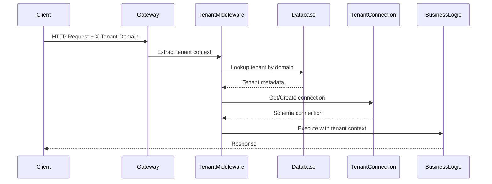
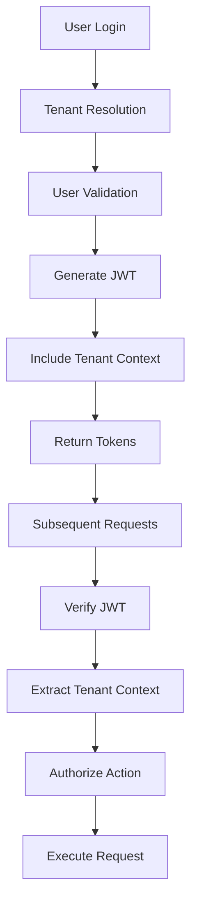

# nexphys Backend - Architecture Guide

## 🏗️ System Overview

nexphys uses a **tenant-per-schema** multi-tenancy architecture, providing complete data isolation while maintaining shared infrastructure.

```
┌─────────────────────────────────────────────────────────────┐
│                    nexphys Platform                          │
├─────────────────────────────────────────────────────────────┤
│  Application Layer                                          │
│  ├── API Gateway           # Request routing & rate limiting │
│  ├── Auth Service          # JWT & tenant resolution        │
│  ├── Business Logic        # Core application logic         │
│  └── Background Jobs       # Async processing               │
├─────────────────────────────────────────────────────────────┤
│  Database Layer                                             │
│  ├── Public Schema         # Global tenant data            │
│  └── Tenant Schemas        # Isolated per-tenant data      │
├─────────────────────────────────────────────────────────────┤
│  Infrastructure Layer                                       │
│  ├── PostgreSQL            # Primary database              │
│  ├── Redis                 # Caching & sessions            │
│  └── File Storage          # Assets & uploads              │
└─────────────────────────────────────────────────────────────┘
```

## 🏢 Multi-Tenancy Strategy

### Tenant-Per-Schema Benefits

✅ **Complete Data Isolation** - Each tenant has its own database schema  
✅ **Security** - No risk of data leakage between tenants  
✅ **Performance** - Optimized queries per tenant  
✅ **Customization** - Schema modifications per tenant  
✅ **Compliance** - Easy data residency & privacy compliance

### Schema Structure

```sql
-- Global Schema (public)
public.tenants              # Tenant registry & metadata
public.subscriptions        # Billing & subscription plans
public.system_settings      # Global system configuration

-- Tenant Schema Example (tenant_gym_abc)
tenant_gym_abc.users        # Gym ABC users & profiles
tenant_gym_abc.roles        # Gym ABC roles & permissions
tenant_gym_abc.workouts     # Gym ABC workout programs
tenant_gym_abc.equipment    # Gym ABC equipment inventory
tenant_gym_abc.analytics    # Gym ABC usage analytics

-- Another Tenant Schema (tenant_studio_xyz)
tenant_studio_xyz.users     # Studio XYZ users & profiles
tenant_studio_xyz.classes   # Studio XYZ class schedules
tenant_studio_xyz.bookings  # Studio XYZ class bookings
```

## 🔧 Application Architecture

### Modular Monolith Design

```
src/
├── modules/                 # Domain-driven modules
│   ├── tenants/            # Tenant lifecycle management
│   │   ├── controllers/    # HTTP request handlers
│   │   ├── services/       # Business logic
│   │   ├── middlewares/    # Tenant resolution
│   │   └── dto/           # Data validation
│   ├── auth/              # Authentication & authorization
│   ├── users/             # User management
│   ├── roles/             # RBAC system
│   └── ...                # Other business modules
├── shared/                # Cross-cutting concerns
│   ├── database/          # Data access layer
│   ├── middlewares/       # Express middlewares
│   ├── utils/             # Helper functions
│   └── services/          # Shared business logic
└── config/                # Application configuration
```

### Layer Architecture

```
┌─────────────────────────────────────────────────────────────┐
│  Presentation Layer (Controllers & Routes)                  │
│  ├── HTTP Request/Response handling                         │
│  ├── Input validation & sanitization                       │
│  └── Response formatting                                    │
├─────────────────────────────────────────────────────────────┤
│  Business Logic Layer (Services)                           │
│  ├── Core business rules                                   │
│  ├── Domain operations                                     │
│  └── Cross-module coordination                             │
├─────────────────────────────────────────────────────────────┤
│  Data Access Layer (Repositories & Entities)               │
│  ├── Database operations                                   │
│  ├── Data mapping & transformation                         │
│  └── Query optimization                                    │
├─────────────────────────────────────────────────────────────┤
│  Infrastructure Layer                                       │
│  ├── Database connections                                  │
│  ├── External API integrations                             │
│  └── File storage & caching                                │
└─────────────────────────────────────────────────────────────┘
```

## 🔄 Request Flow

### Tenant Resolution Process



### Multi-Tenant Request Lifecycle

1. **Request Ingress**
   ```typescript
   // Tenant identification from multiple sources
   const tenantDomain = 
     req.headers['x-tenant-domain'] ||  // Header
     req.subdomains[0] ||               // Subdomain
     req.query.tenant;                  // Query param
   ```

2. **Tenant Validation**
   ```typescript
   // Verify tenant exists and is active
   const tenant = await tenantRepository.findOne({
     where: { domain: tenantDomain, status: 'ACTIVE' }
   });
   ```

3. **Schema Connection**
   ```typescript
   // Get tenant-specific database connection
   const tenantConnection = await connectionService
     .getTenantConnection(tenant.id);
   ```

4. **Business Logic Execution**
   ```typescript
   // Execute request with tenant context
   const userRepository = tenantConnection.getRepository(User);
   const users = await userRepository.find();
   ```

## 🗄️ Database Design

### Connection Management

```typescript
// Connection Pool per Tenant
class TenantConnectionService {
  private static connections = new Map<string, DataSource>();

  static async getTenantConnection(tenantId: string) {
    if (!this.connections.has(tenantId)) {
      const tenant = await this.findTenant(tenantId);
      const connection = this.createConnection(tenant.schemaName);
      await connection.initialize();
      this.connections.set(tenantId, connection);
    }
    
    return this.connections.get(tenantId);
  }
}
```

### Schema Lifecycle

```typescript
// Tenant Schema Management
class SchemaManager {
  // Create new tenant schema
  async createTenantSchema(tenantId: string) {
    const tenant = await this.getTenant(tenantId);
    
    // 1. Create schema
    await this.db.query(`CREATE SCHEMA "${tenant.schemaName}"`);
    
    // 2. Run migrations
    const connection = createTenantConnection(tenant.schemaName);
    await connection.runMigrations();
    
    // 3. Seed initial data
    await this.seedTenantData(connection);
    
    // 4. Mark as ready
    tenant.isSchemaCreated = true;
    await this.saveTenant(tenant);
  }
}
```

### Data Isolation Levels

| Level | Isolation Type | Use Case |
|-------|---------------|----------|
| **Schema** | Complete | Production tenants |
| **Database** | Maximum | Enterprise customers |
| **Row-Level** | Shared tables | Development/testing |

## 🔐 Security Architecture

### Authentication Flow



### Role-Based Access Control (RBAC)

```typescript
// Permission Structure
interface Permission {
  resource: string;    // 'users', 'workouts', 'analytics'
  action: string;      // 'create', 'read', 'update', 'delete'
  conditions?: object; // Additional constraints
}

// Role Hierarchy
enum RoleLevel {
  BASIC = 1,    // End users
  PREMIUM = 2,  // Power users
  MANAGER = 3,  // Staff with management duties
  OWNER = 4     // Full tenant control
}
```

### Security Layers

1. **Network Security**
    - HTTPS enforcement
    - Rate limiting
    - IP whitelisting (optional)

2. **Application Security**
    - JWT token validation
    - RBAC authorization
    - Input sanitization

3. **Data Security**
    - Schema-level isolation
    - Encrypted sensitive data
    - Audit logging

## 📊 Performance Considerations

### Connection Pooling Strategy

```typescript
// Optimized connection configuration
const connectionConfig = {
  max: 20,          // Max connections per tenant
  min: 2,           // Min connections to maintain
  idle: 30000,      // Close idle connections after 30s
  acquire: 60000,   // Max time to acquire connection
  evict: 1000,      // Check for idle connections every 1s
};
```

### Caching Strategy

```typescript
// Multi-level caching
class CacheService {
  // L1: In-memory (tenant metadata)
  private tenantCache = new Map<string, Tenant>();
  
  // L2: Redis (user sessions, frequent data)
  private redis = new Redis(config.redis);
  
  // L3: Database (persistent data)
  private database = getConnection();
}
```

### Query Optimization

```sql
-- Tenant-specific indexes
CREATE INDEX idx_users_tenant_email 
ON tenant_xyz.users(email);

CREATE INDEX idx_workouts_tenant_date 
ON tenant_xyz.workouts(created_at);

-- Cross-tenant queries (public schema only)
CREATE INDEX idx_tenants_domain 
ON public.tenants(domain);
```

## 🔄 Scalability Patterns

### Horizontal Scaling

```yaml
# Multiple API instances
api-service:
  replicas: 3
  load_balancer: round_robin
  health_check: /health

# Database connection per instance
database:
  connections_per_instance: 20
  max_tenant_connections: 100
```

### Tenant Distribution

```typescript
// Tenant routing strategy
class TenantRouter {
  routeTenant(domain: string): DatabaseCluster {
    // Route by hash for even distribution
    const hash = this.hashDomain(domain);
    const cluster = this.clusters[hash % this.clusters.length];
    return cluster;
  }
}
```

## 🚀 Deployment Architecture

### Development Environment

```yaml
# docker-compose.dev.yml
services:
  api:
    build: .
    environment:
      - NODE_ENV=development
      - DB_HOST=postgres
    volumes:
      - .:/app
  
  postgres:
    image: postgres:15
    environment:
      - POSTGRES_DB=nexphys_dev
```

### Production Environment

```yaml
# Production setup (AWS example)
Infrastructure:
  Compute: ECS Fargate (Auto-scaling)
  Database: RDS PostgreSQL Multi-AZ
  Cache: ElastiCache Redis Cluster
  Load Balancer: Application Load Balancer
  Storage: S3 for file uploads
  Monitoring: CloudWatch + DataDog
```

### High Availability Setup

```
┌─────────────────────────────────────────────────────────────┐
│                Load Balancer (ALB)                          │
├─────────────────┬─────────────────┬─────────────────────────┤
│   API Server 1  │   API Server 2  │   API Server 3          │
├─────────────────┴─────────────────┴─────────────────────────┤
│              Database Cluster (Primary + Replica)           │
├─────────────────────────────────────────────────────────────┤
│              Redis Cluster (Sharded)                        │
└─────────────────────────────────────────────────────────────┘
```

## 📈 Monitoring & Observability

### Metrics Collection

```typescript
// Application metrics
class MetricsService {
  // Tenant-specific metrics
  recordTenantMetric(tenantId: string, metric: string, value: number) {
    this.prometheus.histogram
      .labels({ tenant: tenantId, metric })
      .observe(value);
  }
  
  // Request performance
  recordRequestDuration(tenant: string, endpoint: string, duration: number) {
    this.requestDuration
      .labels({ tenant, endpoint })
      .observe(duration);
  }
}
```

### Health Checks

```typescript
// Comprehensive health endpoint
app.get('/health', async (req, res) => {
  const health = {
    status: 'healthy',
    timestamp: new Date().toISOString(),
    database: await checkDatabaseHealth(),
    redis: await checkRedisHealth(),
    tenantSchemas: await checkTenantSchemas(),
    version: process.env.APP_VERSION
  };
  
  res.json(health);
});
```

## 🔮 Future Considerations

### Microservices Migration Path

```
Current: Modular Monolith
    ↓
Phase 1: Extract Tenant Service
    ↓
Phase 2: Extract Auth Service
    ↓
Phase 3: Domain-specific Services
    ↓
Future: Full Microservices
```

### Multi-Region Support

```typescript
// Future: Geographic tenant distribution
interface TenantConfig {
  region: 'us-east-1' | 'eu-west-1' | 'ap-southeast-1';
  dataResidency: 'US' | 'EU' | 'APAC';
  replicationStrategy: 'active-passive' | 'active-active';
}
```

### Advanced Features Roadmap

- **Event Sourcing**: For audit trails and temporal queries
- **CQRS**: Separate read/write models for better performance
- **Graph Database**: For complex relationship queries
- **Real-time Features**: WebSocket support for live updates
- **AI/ML Integration**: Tenant-specific analytics and insights

---

**🏗️ This architecture provides a solid foundation for scaling to thousands of tenants while maintaining security, performance, and feature flexibility.**